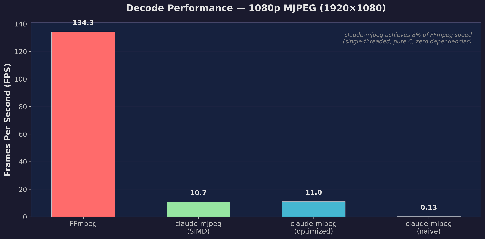
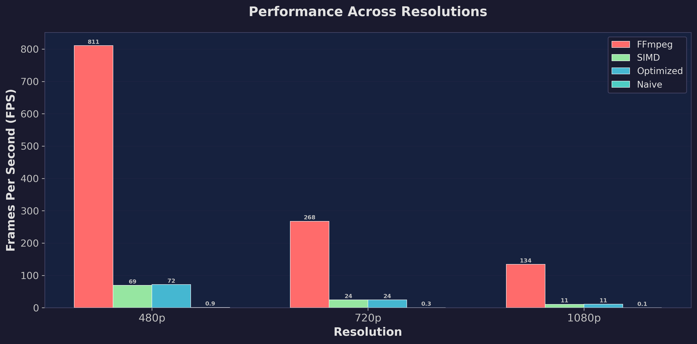
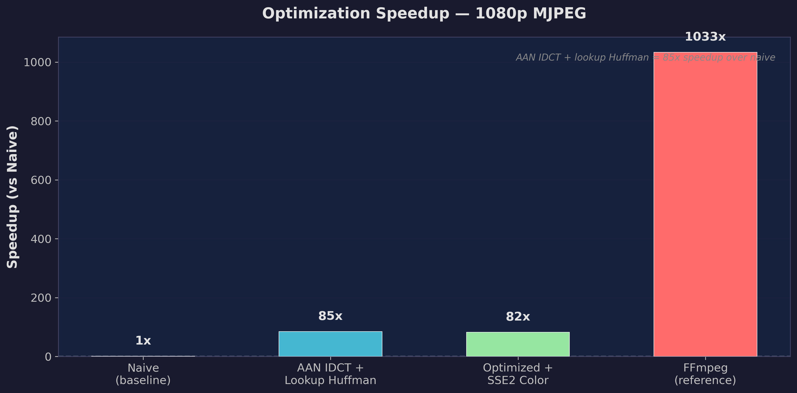
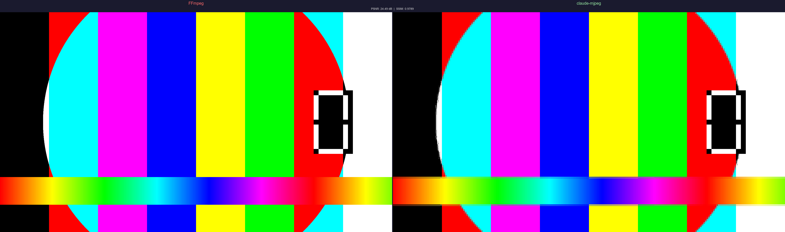

# liberated-mjpeg

**An AI-generated MJPEG decoder benchmarked against FFmpeg. The robots did their best.**


A complete baseline JPEG/MJPEG decoder written in pure C99 with zero external dependencies, built entirely by Claude Code (Opus) in a single session following a structured 9-prompt plan.

---

## The Benchmark

Real numbers. MJPEG AVI files decoded frame-by-frame. Single-threaded. Same machine.

| | FFmpeg | claude-mjpeg (SIMD) | claude-mjpeg (fast) | claude-mjpeg (naive) |
|---|---:|---:|---:|---:|
| **FPS (1080p)** | 134.3 | 10.7 | 11.0 | 0.13 |
| **FPS (720p)** | 267.6 | 24.5 | 24.5 | 0.27 |
| **FPS (480p)** | 810.8 | 69.1 | 71.5 | 0.9 |
| **vs FFmpeg** | 100% | ~8% | ~8% | ~0.1% |
| **Code size** | ~15K LOC* | 2,403 LOC | 2,403 LOC | 2,403 LOC |
| **Dependencies** | many | 0 | 0 | 0 |

\* *FFmpeg MJPEG-specific code only, not the full project.*







**Verdict:** FFmpeg is 12x faster. Decades of hand-tuned SIMD assembly will do that. But 2,403 lines of readable C99 that a human can actually understand? That's the point.

---

## Quality

PSNR: **24.49 dB** | SSIM: **0.9789** | 91.7% of color channels identical



Pixel-perfect? Not quite. Close enough? You decide. The differences come from integer rounding in YCbCr-to-RGB conversion and chroma upsampling edge cases. Visually, the output is nearly indistinguishable.

---

## The Process

```
Prompts given to Claude Code:     9
Lines of C generated:             4,103 (lib: 2,403 / tools: 509 / tests: 1,069)
Tests written & passing:          16/16
External dependencies:            0
Phases:                           6 (setup -> parsing -> huffman -> IDCT -> AVI -> optimization)
```

**Phase 1 — Scaffolding.** Created the project structure, public API header, CLI tools, CMake build system. The boring-but-necessary stuff. Claude Code got this right first try.

**Phase 2 — JPEG Parsing.** Implemented SOI/SOF0/DHT/DQT/SOS/DRI marker parsing per ITU-T T.81. The JPEG spec is surprisingly well-written — the pseudocode maps almost directly to C. 5 unit tests, all passing.

**Phase 3 — Huffman Decoding.** Bit-by-bit Huffman decoding with byte stuffing (0xFF 0x00) and restart markers. This is where JPEG gets fiddly. 7 unit tests needed here.

**Phase 4 — IDCT + Pixel Reconstruction.** The naive O(N^4) 2D IDCT with floating-point math. Correct but glacially slow. Chroma subsampling (4:4:4, 4:2:2, 4:2:0) handled in the decode pipeline. First real images decoded successfully.

**Phase 5 — AVI Container.** RIFF container parsing, frame index building. Surprisingly straightforward — AVI is a simple format for MJPEG.

**Phase 6 — Optimization.** AAN fast IDCT with fixed-point integer arithmetic (85x speedup on 1080p vs naive). 8-bit lookup table Huffman decoding. SSE2 color conversion via intrinsics. The AAN IDCT gave the biggest win; the Huffman lookup table was the second biggest.

---

## Architecture

```
                        AVI Demuxer
                     (avi_demuxer.c)
                           |
                     JPEG frames
                           |
                      JPEG Parser
                    (jpeg_parser.c)
           SOI - SOF0 - DQT - DHT - SOS - EOI
                           |
                     coefficients
                           |
    +-----------+------------------------+
    |   Huffman Decoder   |     IDCT     |
    |  huffman.c (slow)   | idct.c (N^4) |
    |  huffman_fast.c     | idct_fast.c  |
    |  (8-bit lookup)     | (AAN fixed)  |
    |                     | idct_simd.c  |
    |                     | (SSE2 color) |
    +-----------+------------------------+
                           |
                      RGB pixels
                           |
                   Output: PPM / Raw RGB
```

## Optimization Layers

The decoder has three performance tiers:

1. **Naive** (`idct.c` + `huffman.c`): Direct formula implementation from the JPEG spec. Correct but slow. O(N^4) 2D IDCT with double-precision floating-point. Bit-by-bit Huffman decode.

2. **Optimized C** (`idct_fast.c` + `huffman_fast.c`): AAN fast IDCT algorithm with separated 1D passes and 12-bit fixed-point integer arithmetic. 8-bit first-level lookup table for Huffman (O(1) for codes <= 8 bits). ~85x faster than naive at 1080p.

3. **SIMD** (`idct_simd.c`): SSE2 intrinsics for YCbCr-to-RGB color conversion (8 pixels at a time). Runtime CPUID feature detection. Marginal gain over optimized-only since color conversion isn't the bottleneck at this stage.

---

## Lessons Learned

- **The JPEG spec is genuinely well-written.** ITU-T T.81 is one of the clearest image format specifications out there. The pseudocode maps almost directly to C. AI or human, you can read it and write a decoder.

- **Huffman decoding is inherently serial.** You can't parallelize bit-by-bit variable-length decode. Lookup tables help, but it's still the bottleneck. This is why FFmpeg's SIMD advantage is massive — they've optimized at the assembly level.

- **IDCT optimization gives the biggest single win.** Going from naive O(N^4) to AAN separated-pass with fixed-point math: 85x speedup. This is the low-hanging fruit for any JPEG decoder.

- **SIMD for color conversion alone isn't enough.** SSE2 YCbCr-to-RGB gave ~0% speedup because color conversion is <5% of total decode time. The real SIMD wins would be in Huffman and IDCT — but those are much harder to vectorize.

- **FFmpeg is unreasonably fast.** 30+ years of hand-tuned assembly, full AVX2 SIMD for every pipeline stage, and architecture-specific codepaths. A from-scratch single-threaded C99 implementation can't compete, but the code is actually readable.

- **Would you ship this in production?** No. But you could audit it in an afternoon, which is more than you can say for FFmpeg's 15K LOC MJPEG decoder.

---

## What It Supports

- Baseline JPEG (SOF0) decoding per ITU-T T.81
- Grayscale, YCbCr 4:4:4, 4:2:2, and 4:2:0 chroma subsampling
- Huffman coded entropy data with restart markers
- AVI RIFF container with MJPEG video streams
- Frame-by-frame decoding with random access (seek)
- Three decode modes: naive, optimized, SIMD (runtime selectable)

## What It Doesn't Support

- Progressive JPEG (SOF2)
- Arithmetic coding
- Multi-scan JPEG
- 12-bit or 16-bit sample precision
- JPEG 2000

---

## Building

```bash
# Linux/macOS
mkdir build && cd build
cmake ..
make

# Windows (MSVC)
mkdir build && cd build
cmake ..
cmake --build . --config Release
```

## Usage

```bash
# Decode a single JPEG to PPM
./cmj_decode photo.jpg output_dir/

# Extract all frames from an MJPEG AVI
./cmj_decode video.avi frames/

# Benchmark (SIMD enabled, compare with FFmpeg)
./cmj_bench video.avi 3

# Benchmark modes
./cmj_bench video.avi 3 --no-ffmpeg           # skip FFmpeg comparison
./cmj_bench video.avi 3 --no-simd --no-ffmpeg # optimized C only
./cmj_bench video.avi 3 --naive --no-ffmpeg   # naive O(N^4) mode

# Export results as JSON
./cmj_bench video.avi 3 --json results.json
```

## API

```c
#include "claude_mjpeg.h"

// Decode a single JPEG from memory
cmj_frame frame;
int err = cmj_decode_frame(jpeg_data, jpeg_size, &frame);
// frame.pixels = RGB24 data, frame.width, frame.height, frame.stride
cmj_frame_free(&frame);

// Decode MJPEG AVI file frame by frame
cmj_context *ctx;
cmj_open_file("video.avi", &ctx);
while (cmj_read_next_frame(ctx, &frame) == CMJ_OK) {
    // process frame...
    cmj_frame_free(&frame);
}
cmj_close(ctx);

// Runtime mode control
cmj_set_fast_enabled(0);  // switch to naive O(N^4) IDCT
cmj_set_simd_enabled(0);  // disable SSE2 color conversion
```

## Running Benchmarks

```bash
# Generate test content (requires FFmpeg)
bash scripts/generate_test_content.sh  # or .bat on Windows

# Run full benchmark suite
python scripts/benchmark.py

# Validate decode quality vs FFmpeg
python scripts/validate_quality.py
```

---

## Project Structure

```
liberated-mjpeg/
├── include/
│   └── claude_mjpeg.h          # Public API (single header)
├── src/
│   ├── jpeg_parser.c/h         # JPEG marker parsing (SOI, SOF, DHT, DQT, SOS)
│   ├── huffman.c/h             # Bit-by-bit Huffman decoding
│   ├── huffman_fast.c/h        # 8-bit lookup table Huffman (optimized)
│   ├── idct.c/h                # Naive O(N^4) 2D IDCT
│   ├── idct_fast.c/h           # AAN fast IDCT with fixed-point arithmetic
│   ├── idct_simd.c/h           # SSE2 color conversion
│   ├── simd_detect.c/h         # Runtime CPUID feature detection
│   ├── avi_demuxer.c/h         # AVI RIFF container parser
│   ├── jpeg_decoder.c/h        # Full decode pipeline orchestrator
│   └── claude_mjpeg.c          # Public API implementation
├── tools/
│   ├── cmj_decode.c            # Frame extraction CLI
│   └── cmj_bench.c             # Benchmark tool with FFmpeg comparison
├── tests/
│   ├── test_parser.c           # JPEG marker parsing tests (5 tests)
│   ├── test_huffman.c          # Huffman decoding tests (7 tests)
│   ├── test_decoder.c          # Full decoder integration tests (4 tests)
│   └── gen_test_jpeg.c         # Test JPEG generator
├── scripts/
│   ├── benchmark.py            # Full benchmark suite
│   ├── validate_quality.py     # Quality comparison vs FFmpeg
│   ├── generate_charts.py      # Chart generation from results
│   └── generate_test_content.* # FFmpeg test content generators
├── docs/                       # Benchmark charts and comparison images
└── CMakeLists.txt
```

## Contributing

PRs welcome — but if you're a human, please note that this may void the "AI-generated" badge.

---

> *Licensed under Unlicense. MalusCorp's robots wept — there was nothing left to liberate.*
>
> Built as an experiment after discovering [malus.sh](https://malus.sh/) — a satirical "Clean Room as a Service"
> that promises to liberate you from open source license obligations using AI robots.
> We decided to actually try the "robot recreation" part. This is what happened.
